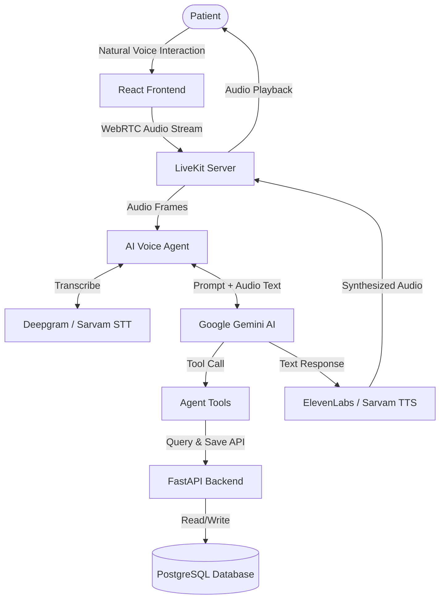

<div align="center">
  

  # AI Hospital Voice Receptionist

  **Next-Generation Voice Appointment Management for Healthcare Facilities**

  [](https://reactjs.org/)
  [](https://fastapi.tiangolo.com/)
  [](https://www.postgresql.org/)
  [](https://livekit.io/)
  [](https://deepmind.google/technologies/gemini/)

  <p align="center">
    <em>Automate patient appointment booking, rescheduling, and history lookup using natural voice conversations in English and Hindi.</em>
  </p>
</div>

---

## Overview

The **AI Hospital Voice Receptionist** fundamentally changes how patients interact with healthcare facilities. Instead of navigating complex IVR menus or waiting on hold for human operators, patients can speak naturally to an AI assistant.

The AI agent transcribes the speech in real-time, understands the patient's intent, and executes necessary backend actions—such as checking doctor availability or canceling an appointment—before responding with a high-quality synthesized voice.

---

## See it in Action

> **Note:** Insert your demo video / GIF here!
>
> ``

---

## Key Features

- **Voice-Based Management**: Book, reschedule, or cancel appointments using natural voice commands.
- **Multilingual Support**: Communicate fluently in English and Hindi.
- **Dynamic AI Providers**: Seamlessly switch between STT (Deepgram, Sarvam, ElevenLabs), LLM (Gemini), and TTS (Sarvam, ElevenLabs) directly from the UI.
- **Real-Time Doctor Availability**: Automatically checks and suggests available time slots and doctors.
- **Agentic Tool-Calling**: Uses Google Gemini tool-calling to execute precise database state updates without hallucinations.
- **Ultra-Low Latency**: Pre-warmed background worker processes completely eliminate cold-start delays.
- **Realistic Call Experience**: Web Audio API generated ringtones and loading states simulate a native phone call experience.

---

## Technology Stack

| Domain | Technology | Description |
| :--- | :--- | :--- |
| **Frontend** | React, Vite, Tailwind CSS | High-performance SPA with modern styling |
| **Backend** | FastAPI, SQLAlchemy | High-performance Python backend for serving APIs |
| **Database** | PostgreSQL | Relational data modeling for Patients, Doctors, and Appointments |
| **AI / LLM** | Google Gemini | Stateful AI orchestration and function calling |
| **Voice Pipelines** | LiveKit, Deepgram, ElevenLabs, Sarvam AI, Silero | Real-time WebRTC audio streaming, VAD, STT, and TTS |

---

## Architecture Diagram



---

## Getting Started

### Prerequisites
- Node.js (v18+)
- Python (3.10+)
- PostgreSQL
- API Keys for LiveKit, Deepgram, ElevenLabs, and Google Gemini

### 1. Clone the Repository
```bash
git clone https://github.com/vishmithapoojary84/ai-hospital-voice-agent.git
cd ai-hospital-voice-agent
```

### 2. Backend Setup
```bash
cd backend

# Create and activate virtual environment
python -m venv .venv
source .venv/bin/activate  # On Windows: .venv\Scripts\activate

# Install dependencies
pip install -r requirements.txt

# Run the backend
uvicorn app.main:app --reload
```

### 3. Frontend Setup
```bash
cd frontend

# Install dependencies
npm install

# Run the development server
npm run dev
```

### 4. AI Agent Setup
```bash
cd ai_agent

# Create and activate virtual environment
python -m venv .venv
source .venv/bin/activate  # On Windows: .venv\Scripts\activate

# Install dependencies
pip install -r requirements.txt

# Environment variables
# Create a .env file and add your GEMINI_API_KEY, LIVEKIT credentials, etc.

# Run the AI worker
python voice_agent.py dev
```

---

## Usage Example

1. Open the app in your browser at `http://localhost:5173`.
2. Connect your microphone and start the interaction.
3. Speak a natural language request:
   > *"Hi, I need to book an appointment with Dr. Sharma tomorrow morning."*
4. Watch the agent seamlessly:
   - Check the database for Dr. Sharma's availability.
   - Verbally confirm the time slot with you.
   - Finalize the booking in the PostgreSQL database.

---

## Roadmap

- [x] Natural Voice Interaction Pipeline
- [x] Agentic Backend with Tool Calling
- [x] Multilingual English and Hindi Support
- [ ] Patient Authentication and Authorization
- [ ] Multiple Hospital Branch Support
- [ ] SMS/Email Appointment Reminders

---

## Author

**Vishmitha Poojary**  
*AI | Backend | Full Stack Development*
